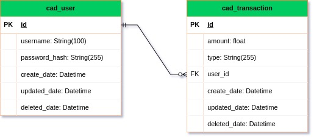

# API - Crédito Expresso

Teste Técnico para criação de uma API simples feita em Node.js para a empresa Crédito expresso.


## Rodando localmente

Clone o projeto

```bash
  git clone https://github.com/Brunoazzireluto/api-credito-expresso
```

Entre no diretório do projeto

```bash
  cd api-credito-expresso
```

Instale as dependências

```bash
  npm install
```

vá até o arquivo data-source.ts que está localizado em ```src/database/data-source.ts```

Descomente a linha 16 para rodar uma 'seed' de usuário fixo, na primeria vez que rodarmos o sistema. 

Em seguide gere uma migration para gerar os modelos de banco de dados:

```bash
npm run migration:generate
```

isso irá gerar uma migration na pasta ```src/database/migrations```

em seguida rode essa migration com o comando:

```bash
npm run migration:run
```

isso irá criar o banco de dados sqlite em ```src/database/database.sqlite```


Inicie o servidor

```bash
  npm run dev
```
Após rodar o sistema pela primeira vez podemos comentar novamente a linha 16 para não gerar mais usuários caso paremos e iniciemos o sistema novamente. 

com isso podemos acessar a api em 
```localhost:3000```
ou acessar pelo swagger em:
```localhost:3000/api-docs/```
## Documentação

Todas as documentações estão na pasta ```Docs/```

### Diagrama ER 


Esse é um diagrama simples da estrutura do banco de dados. 

também temos a versão do draw.io 
### Documentação de rotas

Temos duas formas de acessar as rotas do sistema, uma pelo swagger e outra pelo postman.

caso deseje acessar pelo swagger basta acessar o link da api com api-docs.
ex: ```http://localhost:3000/api-docs/```

caso deseje usar o postman pode importar o arquivo ```API - Credito expresso.postman_collection.json``` diretamente no postman. 


## Ferramentas Utilizadas


## Referência

 - [Express](https://expressjs.com/pt-br/)
 - [Typeorm](https://typeorm.io/)
 - [Swagger](https://swagger.io/)


## Autores

- [Bruno Alves](https://github.com/Brunoazzireluto/)

